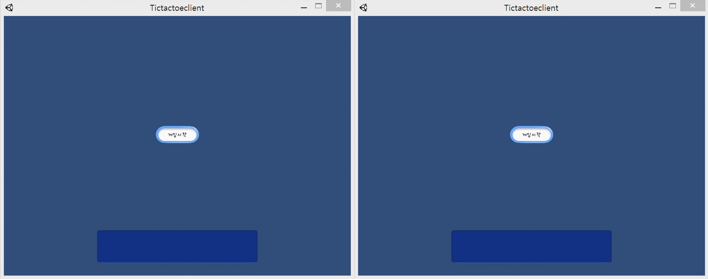

# Tictactoe-client
**Unity를 이용한 TicTacToe 게임**

안녕하세요!  
Unity를 이용하여 만든 실시간 TicTacToe 게임입니다.  

***
***TicTacToe 게임 영상*** / ***Video of the TicTacToe game***

***
**게임소개**
<ul> 1.서버 연결  
heroku서버와 연결되어 있습니다.  
자세한 사항은 아래 링크를 참고해주세요.  
https://github.com/MagicZOL/TTTServer  
</ul>

<ul> 2.게임시작 & 게임준비  
게임시작을 누르면 서버에 연결이 되며 방이 있으면 들어가고 없으면 새로운 방을 생성합니다.  
게임준비 버튼을 누르면 준비상태가 되고 방에 있는 유저 모두가 준비를 눌러야 게임이 시작됩니다.  
</ul>

<ul> 3.O, X
게임 유저는 O 또는 X를 받게 됩니다.  
준비를 먼저 누른 유저가 O를 받으며 선제 턴을 가져갑니다. 
</ul>

<ul> 4.승리 & 패배  
가로, 세로, 왼쪽대각선, 오른쪽대각선이 자신에게 할당된 이미지가 되면 승리하며 "승리했습니다" 라는 메시지가 출력됩니다. 
승리하지 못한 유저는 "패배했습니다"라는 메시지가 출력됩니다.  
승패가 정해지지 않았다면 "비겼습니다"라는 메시지가 출력됩니다.  
확인 버튼 클릭시 처음 화면으로 돌아가게 됩니다.  
</ul>

<ul> 5.실시간 플레이 
실시간으로 방에 매칭이 되고 서로 클릭한 지점이 각각의 유저들에게 보여지게 됩니다.  
</ul>

***

### TicTacToe 게임은 전략을 요구하며 심리전에서 이겨보세요!

***

궁금한 점 및 요청사항은 아래 이메일을 참고해주세요 
구글 이메일 tnwls9721@gmil.com 
네이버 이메일 chfhrtorthsk@naver.com 

***
## Engilsh
# Tictactoe-client
**TacToe Games with Unity**

Hello!  
This is a real-time TicTacToe game created using Unity.  

**Introduction to the Games**
<ul> 1. 1.Server connection  
Connected to heroku server.  
For more information, please refer to the link below.  
https://github.com/MagicZOL/TTTServer  
</ul>

<ul> 2.Gaming starts & Preparing for a game  
When you click Start, you connect to the server, and if there is a room, you can enter it, and if there isn't, create a new room.  
When you press the Ready to play button, you are ready. All users in the room must press Ready to start the game.  
</ul>

<ul> 3.O, X  
The game user will receive an O or X.  
Users who press Ready first receive O and take the first turn.  
</ul>

<ul> 4. Win & lose  
When the horizontal, vertical, left, and right diagonal lines become the images assigned to them, the message "Winned" is displayed.  
Unwinned users are outputted with the message "defeated".  
If victory or defeat has not been determined, the message "Died" will be displayed.  
Click the OK button to return to the first screen.  
</ul>

<ul> 5. Real-time play  
It matches the room in real time, and the points that you click on each other  
</ul>

***

#### The TicTacToe game calls for strategy and wins the psychological warfare!

***

Please refer to the email below for questions and requests.  
Google Email tnwls9721@gmil.com tnwls9721@gmil.com  
Naver e-mail chfhrtorthsk@naver.com  

***

